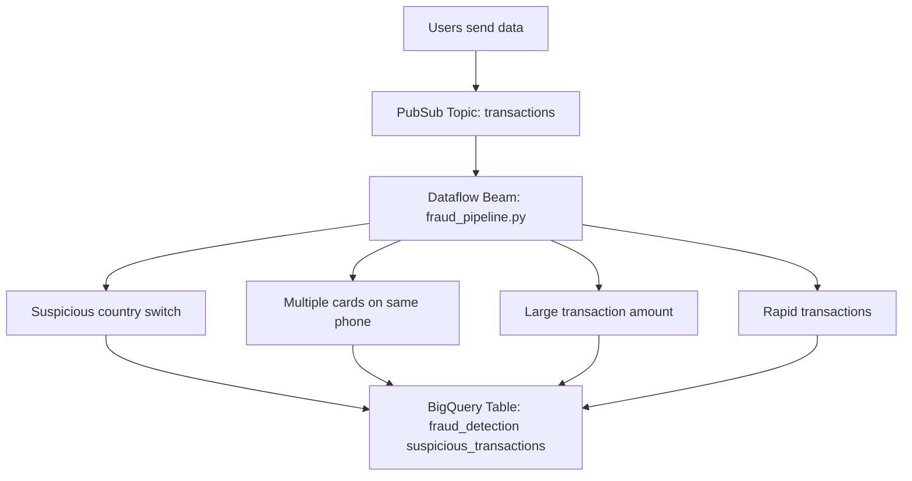

# Felix-Pago

# Felix-pago-test
# Real-Time Fraud Detection Pipeline with Apache Beam, Pub/Sub, Dataflow, and BigQuery

This project implements a real-time fraud detection system using Google Cloud Platform services like Pub/Sub, Dataflow, and BigQuery, powered by Apache Beam to define the streaming data processing pipeline.

---
## 📌 Architecture Real Time

## Fraud Detection Rules
The fraud detection pipeline applies several rules to identify suspicious transactions in real time:

1. Suspicious country switch: When a user makes transactions to different countries within a short period.

2. Multiple cards on the same phone: Multiple card numbers used from the same phone number within 1 minute.

3. Large transaction amount: Any transaction exceeding $1000 is flagged as potentially fraudulent.

4. Rapid transactions: Three or more transactions by the same user within one minute.

## Tech Stack
- Apache Beam: For defining the real-time data pipeline.
- Google Cloud Pub/Sub: To ingest and deliver transaction messages.
- Google Cloud Dataflow: To execute the Beam pipeline in streaming mode.
- Google BigQuery: To store and analyze the detected suspicious transactions.

## Deployment
1. Create Pub/Sub Resources
Create the Pub/Sub topic and subscription to handle incoming transactions:
  
  <pre lang="markdown"> gcloud pubsub topics create transactions </pre>
  <pre lang="markdown"> gcloud pubsub subscriptions create transactions-sub --topic=transactions </pre>

2. Upload and Configure Pipeline
Main script is fraud_pipeline.py, which defines the Beam pipeline to run in streaming mode on Dataflow.

Make sure the following values are correctly configured in the script:
- project
- region
- temp_location

3. Run the Pipeline on Dataflow
To start the streaming job on Dataflow, run:
  
  <pre lang="markdown"> python3 fraud_pipeline.py </pre>
  Make sure your environment has the necessary Python packages installed and permissions.

4. Send Test Messages
You can send sample transactions to the Pub/Sub topic like this:

  <pre lang="markdown"> gcloud pubsub topics publish transactions --message='T001,U001,1500,US,MEX,card,4/19/2025 5:15,1111-2222-3333-4444,1234567890' </pre>
  The message format should be CSV with fields separated by commas.

5. Check BigQuery Output
All suspicious transactions are stored in:

  fraud_detection.suspicious_transactions
  
  For example:
  
  In the fraud_reason column, you can find the type of alert associated with each transaction. For example, user U001 made two transactions using two different cards in under a minute, which could be an indicator of **card testing fraud**.
  

